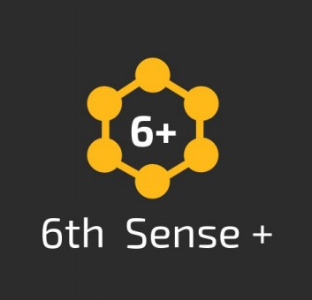

# 6th Sense

Find all the codes to run and build all the features of 6th Sense technologies.


<!--
*** Thanks for checking out the Best-README-Template. If you have a suggestion
*** that would make this better, please fork the repo and create a pull request
*** or simply open an issue with the tag "enhancement".
*** Thanks again! Now go create something AMAZING! :D
***
***
***
*** To avoid retyping too much info. Do a search and replace for the following:
*** github_username, repo_name, twitter_handle, email, project_title, project_description
-->


[![Contributors][contributors-shield]][contributors-url]
[![Forks][forks-shield]][forks-url]
[![Stargazers][stars-shield]][stars-url]
[![Issues][issues-shield]][issues-url]
[![MIT License][license-shield]][license-url]
[![LinkedIn][linkedin-shield]][linkedin-url]


<!-- PROJECT LOGO -->
<br />
<p align="center">
  <a href="https://github.com/KamaljeetSahoo/6thSense">
    
  </a>

  <h3 align="center">6th Sense</h3>

 
</p>


<!-- TABLE OF CONTENTS -->
<details open="open">
  <summary><h2 style="display: inline-block">Table of Contents</h2></summary>
  <ol>
    <li>
      <a href="#about-the-project">About The Project</a>
      <ul>
        <li><a href="#built-with">Built With</a></li>
      </ul>
    </li>
    <li>
      <a href="#getting-started">Getting Started</a>
      <ul>
        <li><a href="#requirements">Requirement</a></li>
      </ul>
    </li>
    <li><a href="#usage">Usage</a></li>
    <li><a href="#license">License</a></li>
    <li><a href="#contact">Contact</a></li>
    <li><a href="#acknowledgements">Acknowledgements</a></li>
  </ol>
</details>


<!-- ABOUT THE PROJECT -->
## About The Project

**Our Product The Sixth-Sense will serve as an interface cum assistant for the specially-abled individuals primarily suffering from visual impairment, hearing impairment and muteness.6th sense aims to bridge the gap between such individuals and the real world along with its challenges upto a level that hasn’t been achieved yet.**


### Built With

* [https://pytorch.org/](Pytorch)
* [https://www.tensorflow.org/](Tensorflow)
* [https://opencv.org/](OpenCV)
* [https://rapidapi.com/marketplace](RapidAPI)
* [https://pypi.org/project/PyQt5/](PyQt5)
* [https://www.pygame.org/news](PyGame)


<!-- GETTING STARTED -->
## Getting Started

To get a local copy up and running follow these simple steps.

### Requirement

Run the below code in the terminal of your environment.

  ```sh
  pip install -r requirements.txt 
  ```


<!-- USAGE EXAMPLES -->
## Instructions 

Follow the Below Instructiins to use the codes as features of this repo.
 
### Hand Sign Langauge Detection
 
The folder Hand_symbol_Detection contains the code for the same.

**Epoch.pt** contains the trained model weights to run the model.

Run **Main.py** to get the hand symbol detected output from a given hand image.


### Pose Estimation
 
The folder Pose_Estimation_Mobilenet contains the code for the same.

**utils** folder contains the training utils to run and detect body pose.

**weights** folder ontains the trained model weights to run the model.

**Model.py** contains the code for model architrecture

Run **Video.py** to get the pose estimation and a roi around the hand which coould be used for hand symbol recognition.

### GUI
The GUI has 4 parts:
* Hand Symbol Recognition
* OCR 
* Image Captioning
* Text to Speech

### DASHBOARD
To run the gui prepared in PyQt5 
 ```sh
  cd DashBoard
  ```
 ```sh
  python main.py
  ```
## Text and speech transformation

**text2speech_and_speech2text.ipnyb** contains the code for speech and text conversion. This is to help the dumb people to convert their words into speech. They need to write what they want to say in the text field of the software and click on **play generated speech** button. Then their words will be converted into speech that will help them to communicate.


### OCR

**Model.py** contains the code for the ocr to get characters from an image 
Optical character recognition convert the text present in image to machine encoded text.
This is to help the blind people to read. To help the blind people we have converted the generated text to speech.
This also helps the dumb people. They can write whatever they wanted to speak in a paper and upload the image. Then our software will convert that to speech.
To use the ocr you need to click the **upload image** button ,then choose an image location  and then click open. Then our software will convert the text present in image to speech.

## Image Captioning
This software captions the image and helps the blind person to see the world. The captioned text is converted to speech to help the blind person. We can upload image in two ways.One by selecting the image location and the other one by taking picture directly from the camera.
To upload a image select **upload an image** button and select an image location and click ok. After that our software will caption the image and convert it to text. To click an image from camera, click on the **click a picture** button and then click on click photo andd close the camera tab. Then our software will caption the clicked image and convert it to speech.


<!-- LICENSE -->
## License

Distributed under the MIT License. See `LICENSE` for more information.


<!-- CONTACT -->
## Contact
#### Team Members

Kamaljeet Sahoo- [KamaljeetSahoo](https://github.com/KamaljeetSahoo)


Smruti Sikha Panigrahi - [SmrutiSikha](https://github.com/SmrutiSikha)


Komal Trishna Behera - [komalbehera](https://github.com/komalbehera)

Raj Aaryaman Patra - [RajArPatra](https://github.com/RajArPatra)


<!-- ACKNOWLEDGEMENTS -->
## Acknowledgements

* []()
* []()
* []()


<!-- MARKDOWN LINKS & IMAGES -->
<!-- https://www.markdownguide.org/basic-syntax/#reference-style-links -->
[contributors-shield]: https://img.shields.io/github/contributors/github_username/repo.svg?style=for-the-badge
[contributors-url]: https://github.com/github_username/repo/graphs/contributors
[forks-shield]: https://img.shields.io/github/forks/github_username/repo.svg?style=for-the-badge
[forks-url]: https://github.com/github_username/repo/network/members
[stars-shield]: https://img.shields.io/github/stars/github_username/repo.svg?style=for-the-badge
[stars-url]: https://github.com/github_username/repo/stargazers
[issues-shield]: https://img.shields.io/github/issues/github_username/repo.svg?style=for-the-badge
[issues-url]: https://github.com/github_username/repo/issues
[license-shield]: https://img.shields.io/github/license/github_username/repo.svg?style=for-the-badge
[license-url]: https://github.com/github_username/repo/blob/master/LICENSE.txt
[linkedin-shield]: https://img.shields.io/badge/-LinkedIn-black.svg?style=for-the-badge&logo=linkedin&colorB=555
[linkedin-url]: https://linkedin.com/in/github_username
